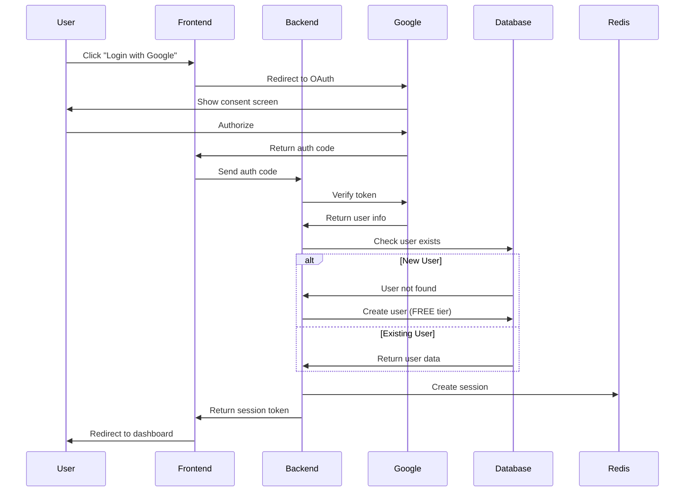
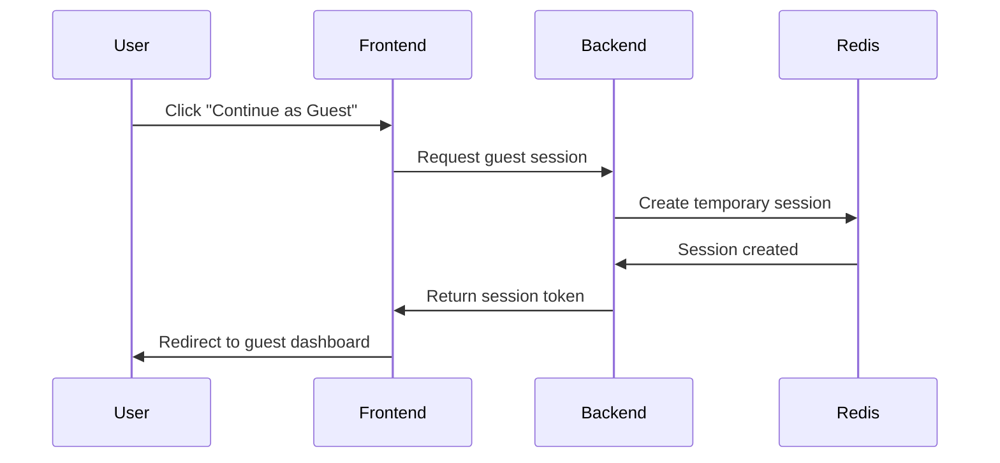
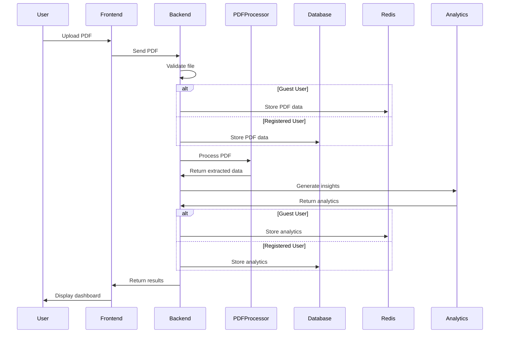
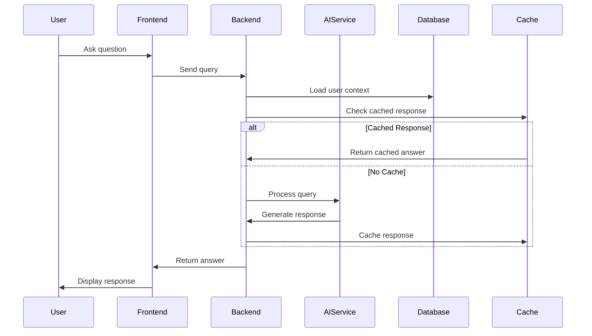
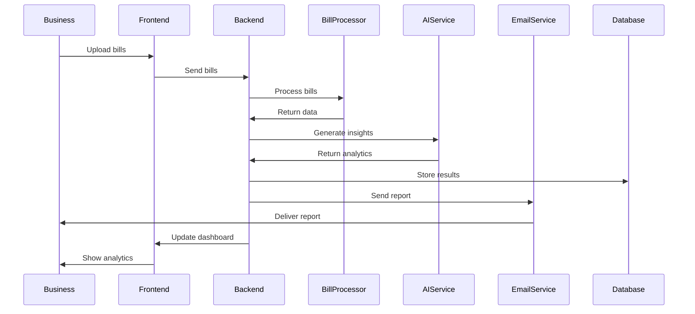
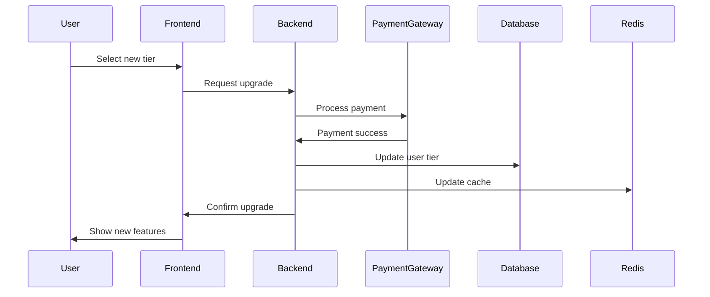

# Sequence Diagrams

## 1. User Authentication Flow

### 1.1 Google OAuth Login

### 1.2 Guest Session

## 2. Bank Statement Processing

### 2.1 PDF Upload and Analysis

## 3. Premium Features

### 3.1 AI Chat Interaction

### 3.2 Business Bill Analysis

## 4. Subscription Management

### 4.1 Tier Upgrade
